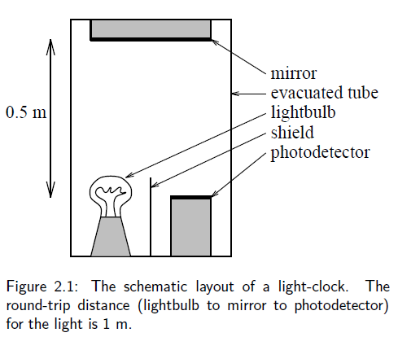
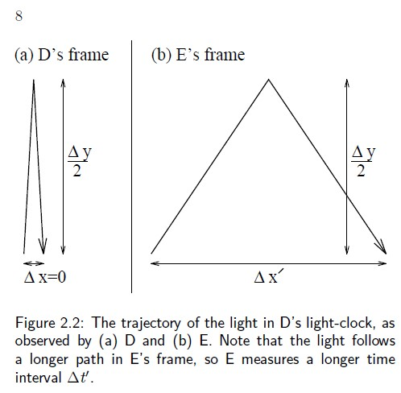
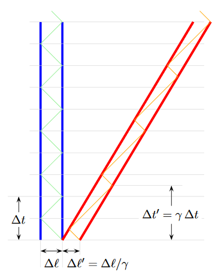

# Specialaus reliatyvumo judėjimo vaizdavimas - erdvėlaikio diagramos

Kalbėdamas apie apie šviesos greičio pastovumą inertinėse atskaitos sistemose
D.Hogg aptaria du stebėtojus, Deepto (D) ir Eriką (E), kurie juda vienas kito
atžvilgiu, rankoje laikydami šviesos laikrodį.

 

Kai bandome šviesos judėjimą pavaizduoti erdvėlaikio diagramose, vaizdas gali
pasidaryti gana painus.

 

Ypač, kai vaizduojamas šviesos judėjimas tarp veidrodžių, pačių veidrodžių
nerodant:

Bandydamas suprasti, kaip atrodo šviesos judėjimas 3D diagramoje, buitiškai
pasirašiau programėlę panaudodamas ROOT bibliotekas.

Pirminis, prototipinis kodas - `drawMirror.C` - vėliau virto kiek pažangesniu
kodu `drawMirror2.C`. Pastarasis kodas vaizduoja šviesos judėjimą tarp
veikėjo laikrodžio veidrodžių, kai veikėjas juda arba nejuda laboratorinėje
atskaitos sistemoje. Nebandžiau
suderinti stebėtojų laikrodžių - man norėjosi pamatyti kokiu būdu nepilname
vaizdavime gali susidaryti įspūdis, kad šviesa juda $x$ kryptimi pirmyn-atgal.

ROOT macro `drawMirror2` turi tris argumentus: laiko indeksą (`time_pos`), ar 
reikia piešinėlius išsaugoti (`doSave`) ir ar laikrodį laikantis veikėjas
juda (`move`).

Iš pradžių tiesiog norėjau išsaugoti piešinėlius, tai pasirašiau `bash`
skriptą `run2.sh`, o paskui supratau, kad galiu pagaminti ir animacinį `gif`
paveikslėlį, tad parašiau `anim.sh`. Pastarasis skriptas yra parengtas
nejudančio veikėjo atvejui. Norėdami sujungti judančio veikėjo vaizdus į
`gif`, turėtumėte sukurti adaptuotą skripto `anim.sh` versiją.

Sėkmės išbandant.

 
**Bibliography**

[1] D.W.Hogg, "Special Relativity", Lecture notes, December 1, 1997.
